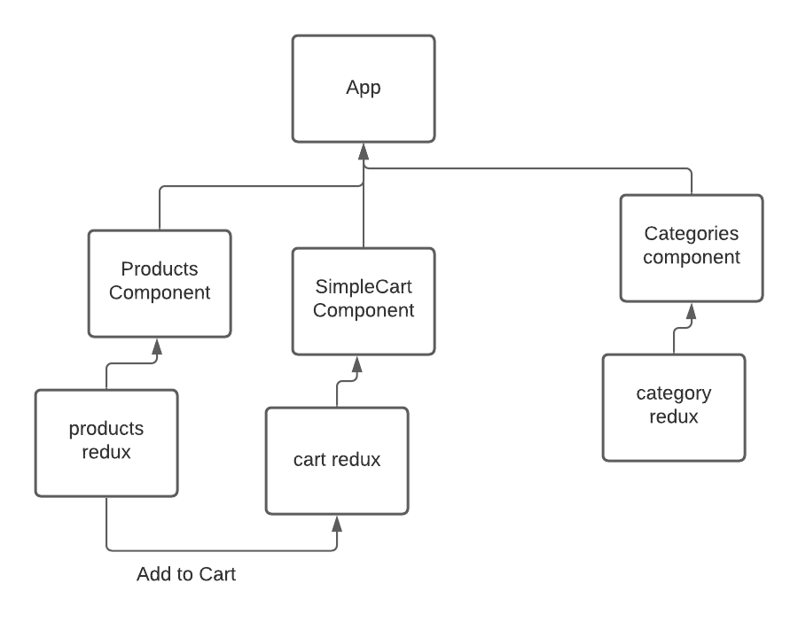

Phase 2 Requirements

In phase 2, we will be adding the “Add to Cart” feature to our application, which will allow our users to not only browse items in the store, but also select them and have them persist in their “shopping cart” for later purchase.

The user stories from Phase 1 remain unchanged. For this phase, we are now adding the following new user stories to meet the new requirements.

As a user, I want to choose from products in the list and add them to my shopping cart
As a user, I want to see the products that I’ve added to my shopping cart so that
As a user, I want to change the quantity of items I intend to purchase in my shopping cart
As a user, I want to be able to remove an item from my shopping cart
Application Flow:

User sees a list of categories
… Chooses a category and sees a list of products
… Clicks the “Add to Cart” button on any product
… Clicks the “Cart” link in the header
… Sees a list of all products in the cart
… Clicks the delete button on an item and sees the item removed
… Changes the quantity selector on an item and sees the cart total change

DEPLOYED SANDBOX:
https://zwc2g.csb.app/

